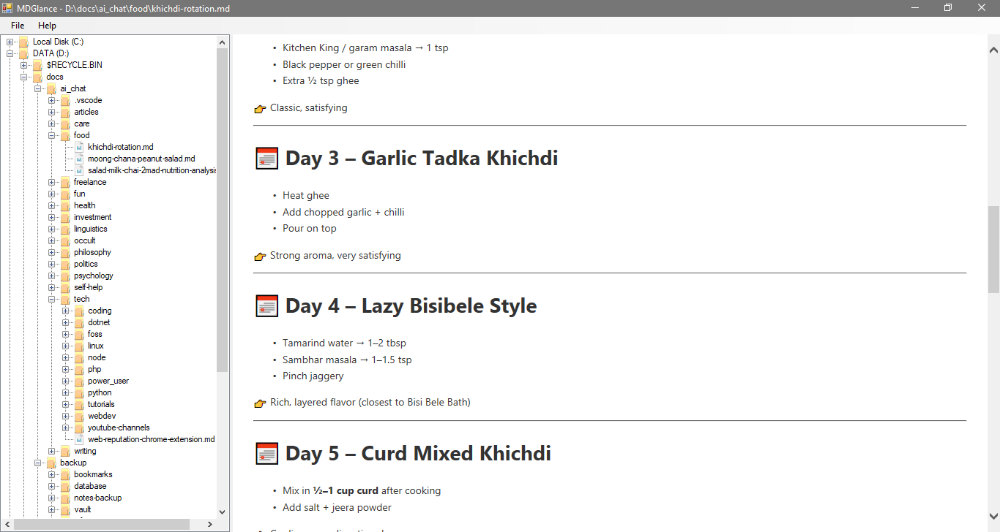

Fast, minimal, and dependency-free Markdown viewing on Windows.

## Genesis

My first acquaintance with Markdown syntax was when I started blogging and "redditing" many years ago, it used to be a way of authoring posts and blog articles with software like jekyll back then. But today, it's turned quite ubiquitous and found everywhere and most importantly, it's the language preferred by LLMs like chatgpt and gemini.

Consequently, you need a way to easily browse these important chat logs stored on your computer. My preference for such a tool is one that is both minimal and utilitarian at the same time (which is quite a rarity these days!), and that's how MDGlance was born on 31st May, 2026.

## Install

Just get the latest release build [from here](https://github.com/prahladyeri/mdglance/releases/latest) and extract it inside a directory of your choice such as `C:\Programs\`, create a shortcut and place on your desktop for regular access.

## Screenshots

## Build

Any Visual Studio Edition including Professional, Community, Express, etc. released in the last decade can be used to build the solution.

## Compatibility

- Runs on Windows 7 and later as long as .NET Framework 4 or above is installed.
- Should run on Linux too through WINE compatibility layer.